<picture>
  <source media="(prefers-color-scheme: dark)" srcset="assets/hero-dark.svg">
  
</picture>

<picture>
  <source media="(prefers-color-scheme: dark)" srcset="assets/divider-about-dark.svg">
  
</picture>

I'm a Computer Science student at **UET Taxila** and a freelance developer who builds whole products, from the interface down to the protocol. I like software that has to survive the real world: no internet, an old Windows PC, a printer that only speaks USB, and a customer who will hold a ruler against the result.

- **Founder** — [Havlen](https://havlen-seven.vercel.app/), an AI receptionist that answers customers on WhatsApp and the web in English or Roman Urdu, books real appointments and hands over to staff when it should
- **Now** — building an AI-in-the-loop data pipeline for **AICON'26** at NUST (Next.js, TypeScript, Gemini)
- **Usually** — web apps, Electron desktop apps, Android apps in Kotlin, and the Python and Node.js backends behind them
- **How I build** — vibe coding with AI agents, then testing in the real world until it holds up
- **Care about** — privacy by default, and getting it right to the millimetre

<picture>
  <source media="(prefers-color-scheme: dark)" srcset="assets/divider-work-dark.svg">
  
</picture>

  <a href="https://havlen-seven.vercel.app/"><picture>
    <source media="(prefers-color-scheme: dark)" srcset="assets/card-havlen-dark.svg">
    
  </picture></a>
  <a href="https://github.com/hafeee44-lab/PrintBridge"><picture>
    <source media="(prefers-color-scheme: dark)" srcset="assets/card-printbridge-dark.svg">
    
  </picture></a>
  <a href="https://play.google.com/store/apps/details?id=com.hafi.locationalarm"><picture>
    <source media="(prefers-color-scheme: dark)" srcset="assets/card-gpsalarm-dark.svg">
    
  </picture></a>
  <a href="https://github.com/hafeee44-lab/duplex"><picture>
    <source media="(prefers-color-scheme: dark)" srcset="assets/card-duplex-dark.svg">
    
  </picture></a>
  <a href="https://github.com/hafeee44-lab/quickprint"><picture>
    <source media="(prefers-color-scheme: dark)" srcset="assets/card-quickprint-dark.svg">
    
  </picture></a>

See them live: <a href="https://havlen-seven.vercel.app/">Havlen</a> · <a href="https://play.google.com/store/apps/details?id=com.hafi.locationalarm">GPS Alarm on Google Play</a> · <a href="https://cnic-duplex.vercel.app">Duplex in your browser</a>

<picture>
  <source media="(prefers-color-scheme: dark)" srcset="assets/divider-toolbox-dark.svg">
  
</picture>

  <picture>
    <source media="(prefers-color-scheme: dark)" srcset="https://skillicons.dev/icons?i=python%2Cts%2Cjs%2Ckotlin%2Chtml%2Ccss%2Cnodejs%2Cnextjs&theme=dark">
    
  </picture>
   
  <picture>
    <source media="(prefers-color-scheme: dark)" srcset="https://skillicons.dev/icons?i=electron%2Candroidstudio%2Cgit%2Cgithub%2Cgithubactions%2Cvercel%2Cwindows&theme=dark">
    
  </picture>

<picture>
  <source media="(prefers-color-scheme: dark)" srcset="assets/divider-contact-dark.svg">
  
</picture>

  Have an app, a printer or a pipeline that won't behave? I'd like to hear about it.
    
  <a href="mailto:hafeee44@gmail.com"><b>Email</b></a> &nbsp;·&nbsp;
  <a href="https://www.linkedin.com/in/muhammad-hafi-b37193222/"><b>LinkedIn</b></a>

<picture>
  <source media="(prefers-color-scheme: dark)" srcset="assets/footer-dark.svg">
  
</picture>
